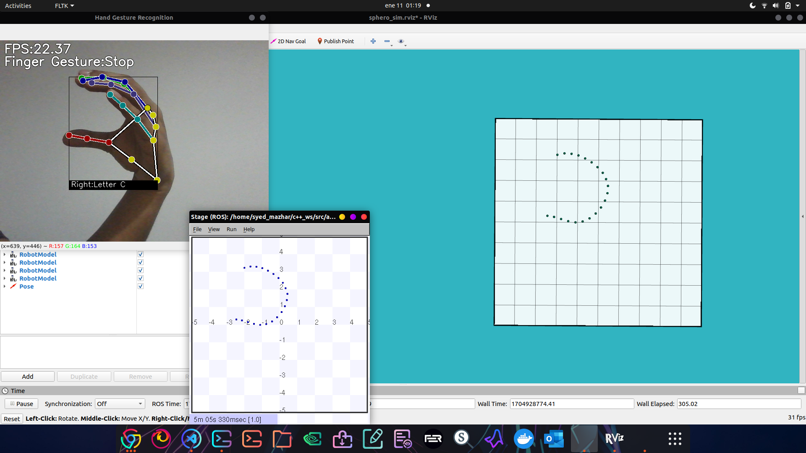

# How to run the file

- Clone the repo 
- roscore
- rosrun hri_sphero_stage start.py (Run the simulation)
- rosrun hri_sphero_stage call_without_face.py (Hand gesture and landmark detection)
- rosrun hri_sphero_stage control_swarm.py (Control the swarm)

# With face recognition 

Firstly, Install the face detection module with the command below

pip3 install face_recognition

Then, type the below commands on terminal

- roscore
- rosrun hri_sphero_stage start.py (Run the simulation)
- rosrun hri_sphero_stage face_recog_stream (For face recognition) (Dont forget to put your image in facemodel folder and replace the name in in the code)
- rosrun hri_sphero_stage call.py (Hand gesture and landmark detection)
- rosrun hri_sphero_stage control_swarm.py (Control the swarm)

<!--  -->
<!--  -->

  

